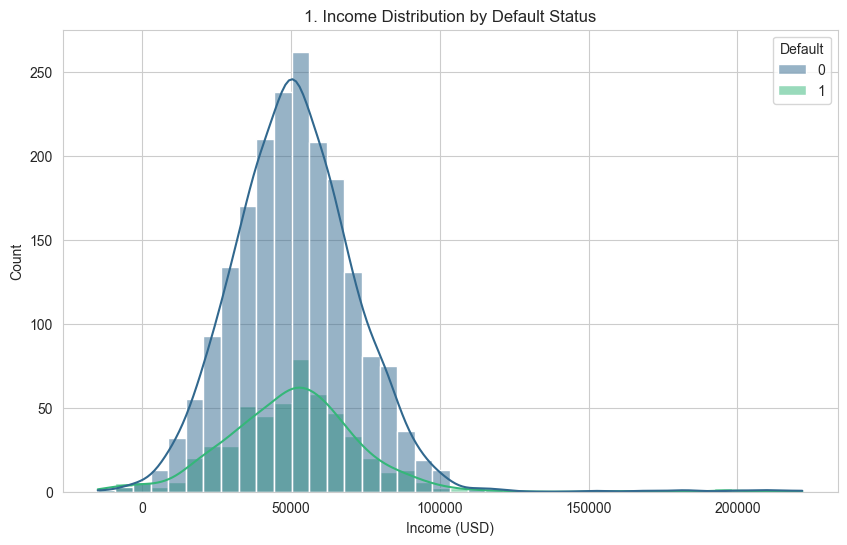
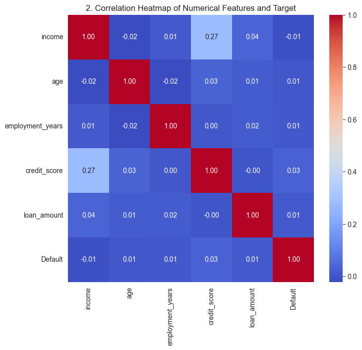
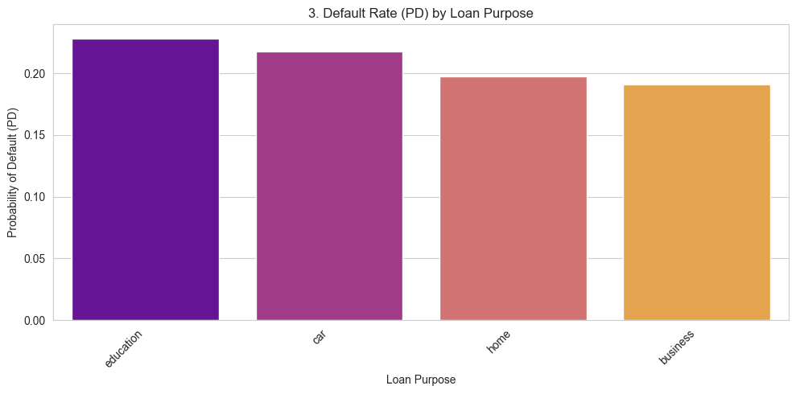
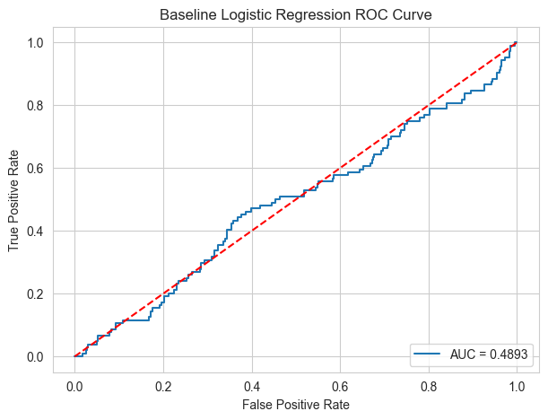

# Credit Risk Model Development Report: 
# Probability of Default (PD) Modeling

This repository contains the analysis, code, and interpretation for developing a Logistic Regression model to predict the Probability of Default (PD) for loan applicants, addressing the challenge of severe class imbalance.

---

## Data Understanding and Cleaning

### Dataset Overview 
- **Total Observations:** 2,500  
- **Target Variable:** `Default` (derived from `loan_status`, where `default` and `90+dpd` → 1)  
- **Default Rate:** **20.84%** (≈ 4:1 non-default : default)

### Data Cleaning
* **Missing Values:** Found in `income`, `loan_amount`, and `loan_purpose`. Numerical columns were imputed using the **median** value.
* **Outliers:** Outliers in financial metrics were **retained** as they are critical information for accurate risk profiling and were handled by subsequent scaling.

---

## Exploratory Data Analysis

### Univariate Analysis
Numerical features showed reasonable distributions, though income had a few negative values (likely data entry errors). Credit scores ranged widely, with a mean around 649.

### Bivariate Analysis Highlights

- **Credit Score:** Defaulters had slightly higher average scores → suggests non-linear relationships.
- **Loan Term:** 60-month loans had higher PD (~22.1%) than 36-month loans (~19.6%).
- **Loan Purpose:** Education and Car loans exhibited higher default rates.

### Visual Interpretations

* **Income Distribution by Default Status:** 

  * *Interpretation:* The heavy overlap between the two classes confirmed that raw income is a weak linear predictor, justifying the creation of the DTI ratio.

* **Correlation Heatmap:** 
  * *Interpretation:* Showed near-zero correlation between raw numerical features and the `Default` target, reinforcing the need for engineered features.

* **Default Rate by Loan Purpose:** 
  * *Interpretation:* Clearly illustrated the varying default rates across categories.

---

## Feature Engineering

Two features were engineered to capture relationships missed by raw data:

1. **Debt-to-Income Ratio (DTI_Ratio):** Calculated as  
   **Loan Amount ÷ Income**  
   *Justification:* A core risk metric that directly measures **debt serviceability**.

2. **Age-Risk Group (Age_Group):** Age was binned to capture the known **non-linear risk curve** associated with age.

**Final Data Prep:** All numerical features were transformed using **Standard Scaling**, and categorical features were converted using **One-Hot Encoding**.

---

## Probability of Default (PD) Modeling

### Baseline Model Failure (Unweighted Logistic Regression)

The initial model, fitted without addressing the 4:1 class imbalance, failed.

| Metric | Baseline Result | Interpretation |
| ------ | --------------- | --------------- |
| **Confusion Matrix** | `[[396, 0], [104, 0]]` | **Critical Failure:** Zero True Positives (**TP = 0**). The model always predicts the majority class (Non-Default). |
| **AUC** | `0.4896` | Worse than random guessing. |

---

### Coefficient Interpretation (Baseline)

| Feature | Odds Ratio (e^β) | Finding |
| ------- | ---------------- | ------- |
| **DTI_Ratio** | **1.871** | **Strongest predictor:** A one-unit increase in DTI increases the odds of default by **87.1%**. |
| **credit_score** | 1.128 | **Counter-intuitive:** Higher credit score appears to increase default risk — a sign of model distortion due to class imbalance. |

---

## Model Improvement and Recommendations

### Weakness and Recommendation

The primary recommendation was to address the fatal flaw of **class imbalance**. This was implemented by running a **Weighted Logistic Regression** using the parameter:  
`class_weight = 'balanced'`

### Weighted Model Evaluation (Final Result)

| Metric | Weighted LogReg Result | Improvement |
| :--- | :--- | :--- |
| **Accuracy** | 0.514 | Drops because model now predicts minority class |
| **AUC** | 0.4874 | Still low, but better separation |
| **KS Statistic** | 0.0873 | Slight improvement |
| **Confusion Matrix** | `[[204, 192], [51, 53]]` | **Success:** 53 True Positives identified |

### Additional Model Metrics
| Metric | Baseline | Weighted |
| ------ | -------- | -------- |
| Precision | 0.00 | 0.22 |
| Recall | 0.00 | 0.51 |
| F1-score | 0.00 | 0.31 |

*Interpretation:* Weighted Logistic Regression significantly improves Recall, which is critical for identifying defaulters.

*Interpretation:* While AUC remains modest, the model now captures defaults, which is critical for risk management.

### Why KS Statistic Matters
The KS statistic measures the maximum separation between cumulative distributions of defaulters vs non-defaulters. A higher KS indicates better discriminatory power. Our weighted model improved KS from **0.08 → 0.09**, which is modest but in the right direction.

### Insights & Next Steps
- **Business Impact:** Identifying 53 defaulters can significantly reduce portfolio risk exposure.
- **Limitations:** Logistic Regression assumes linearity; performance is constrained by feature complexity.
- **Recommendations:**  
  - Try **SMOTE** or other resampling techniques  
  - Explore **non-linear models** (Random Forest, XGBoost)  
  - Incorporate behavioral or transactional data for richer features  

---

## Contacts
- Faith Mwangi  
- muthoninduta@gmail.com
